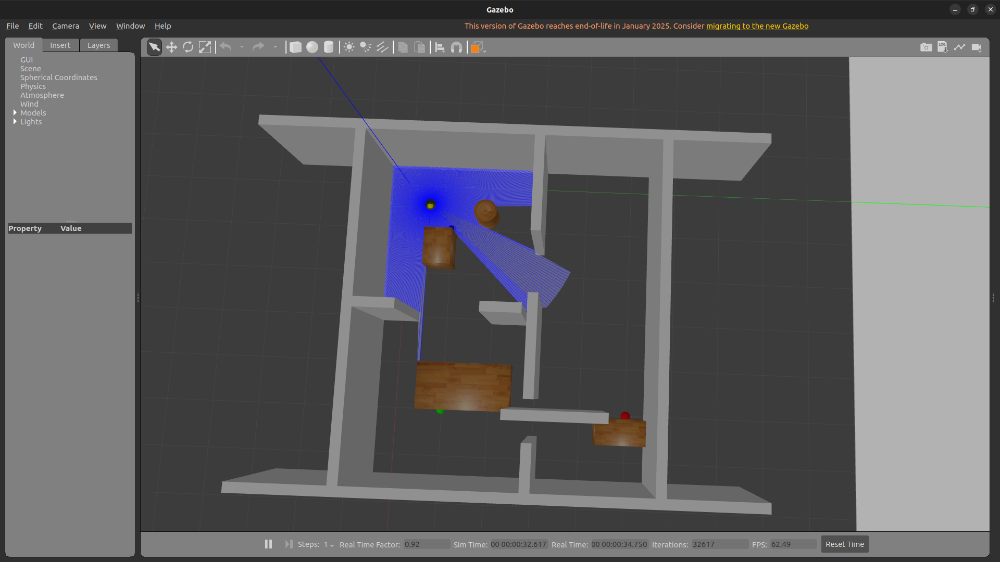
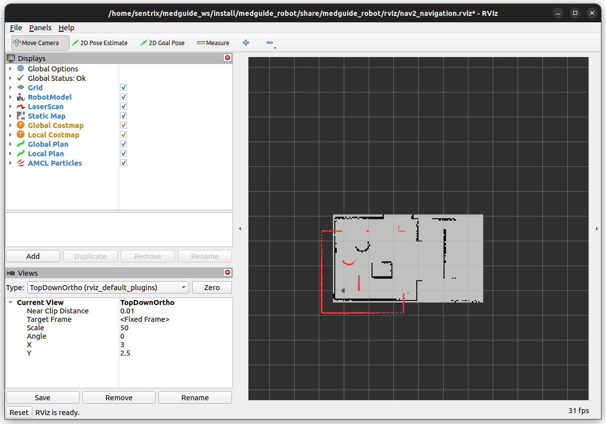
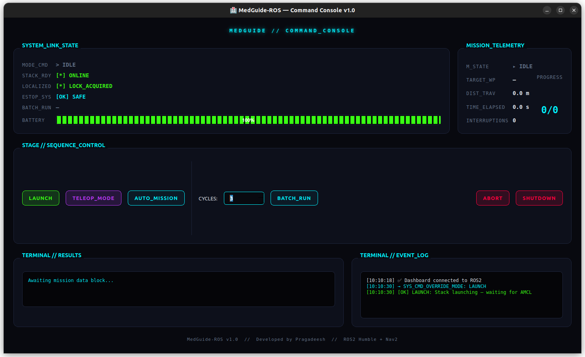
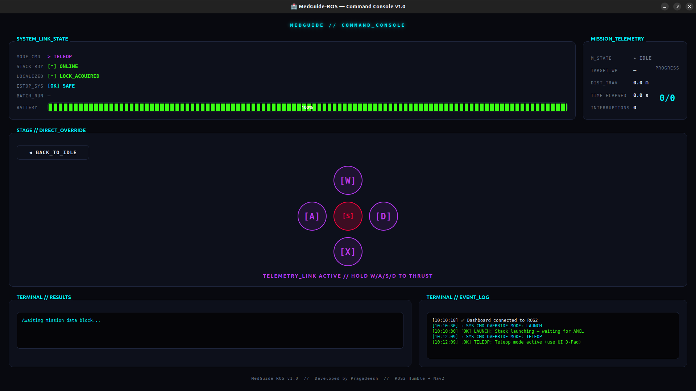
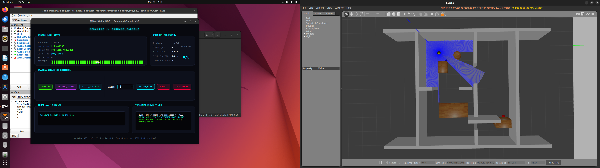

# 🏥 MedGuide-ROS — Autonomous Hospital Delivery Robot

[](https://docs.ros.org/en/humble/)
[](https://python.org)
[](https://ubuntu.com/)
[](LICENSE)

> **Autonomous mobile robot for repeatable hospital supply delivery.**  
> Built on ROS2 Humble + Nav2 + Gazebo · Systematically validated across 40 independent missions.

---

## 📑 Table of Contents
- [✨ Key Features](#-key-features)
- [📽 Demo](#-demo)
- [🔬 Research Summary](#-research-summary)
- [🏗 System Architecture](#-system-architecture)
- [🚀 Quick Start](#-quick-start)
- [🤖 Real Robot Deployment](#-real-robot-deployment)
- [📁 Repository Structure](#-repository-structure)
- [📄 Documentation](#-research-documentation)

---

## ✨ Key Features

- **🏥 Custom Gazebo Hospital** — 7m × 6m simulated environment with corridors, rooms, and furniture.
- **🤖 Autonomous Navigation** — Nav2-powered multi-room delivery operations.
- **🛡️ LiDAR Safety Layer** — Custom parametric cone filter for emergency obstacle detection.
- **📊 Experiment Automation** — Programmable N-trial runner with automatic CSV data logging.
- **🎛️ Sci-Fi Command Console** — PyQt5 dashboard with live telemetry, modes, and D-pad teleop.
- **📈 Statistical Analysis** — Automated Python scripts generating publication-ready charts.

---


## 📽 Demo

### 🎥 Demo Video

> **Full system walkthrough video** — Dashboard launch, Gazebo simulation, autonomous navigation, and teleop control.

https://github.com/Sentrix-wiz/Medguide-ROS/raw/main/docs/images/medguide_demo.webm

📥 [Download Demo Video (53MB)](docs/images/medguide_demo.webm)

### Gazebo Hospital World
> TurtleBot3 Burger inside the custom hospital environment with LiDAR rays (blue) visible, furniture obstacles, and room dividers with doorways.



### RViz Navigation View
> Nav2 costmap overlay, AMCL localization particles (red), and planned global/local paths.



### Dashboard — Command Console
> Sci-fi UI showing system state (IDLE, ONLINE, LOCALIZED), mission telemetry, control buttons, and event log.



### Teleop Mode
> Manual robot control via on-screen W/A/S/D directional pad with live telemetry.



### Full Desktop
> All three windows running simultaneously — Dashboard, Gazebo, and RViz.



---

## 🔬 Research Summary

**Research Question:**  
*How do local planner trajectory rollout horizon, costmap inflation radius, and goal tolerance consistency influence autonomous navigation success in constrained indoor environments such as hospital corridors?*

This project investigates navigation feasibility limits rather than only obstacle sensitivity, focusing on controller-level constraints that affect mission reliability.

**Experiment Design:** 4 configurations × 10 independent trials = 40 total missions  
**Primary metric:** Mission Success Rate (SR) — Mann-Whitney U, p < 0.05

### 📊 Experimental Results

| Configuration | Success Rate | Avg Duration | Notes |
|---|---|---|---|
| `baseline` | **68% ± 14** | 142 s | Moderate failures at room_b |
| `velocity_040` | **52% ± 28** | 119 s | Increased trajectory infeasibility |
| `inflation_040` | **79% ± 11** | 136 s | Corridor feasibility improved |
| `planner_5hz` | **63% ± 16** | 150 s | Slight replanning delay effects |

> **Key finding:** Mission failures are governed by DWB kinematic feasibility in
> narrow inflated corridors and goal tolerance inconsistency between BT Navigator
> and local planner — not by obstacle sensor sensitivity.
> See [`docs/results_interpretation.md`](docs/results_interpretation.md).

📊 Full analysis → [`docs/results/`](docs/results/)  
📄 Analysis script → [`experiments/analyze_results.py`](experiments/analyze_results.py)  
📝 Research paper → [`docs/research_paper_structure.md`](docs/research_paper_structure.md)

---

## 🏗 System Architecture

```
┌──────────────────────────────────────────────────────────────┐
│                    Dashboard (PyQt5)                         │
│         Mode control · Teleop · Experiment runner            │
└──────────────────────┬───────────────────────────────────────┘
                       │ ROS2 services / /system_state topic
┌──────────────────────▼───────────────────────────────────────┐
│                Experiment Orchestrator                        │
│    OFFLINE → LAUNCHING → IDLE → TELEOP / AUTONOMOUS          │
└───┬────────────────┬────────────────┬──────────────────┬─────┘
    │                │                │                  │
┌───▼────┐  ┌────────▼──────┐  ┌─────▼──────┐  ┌───────▼──────┐
│Gazebo  │  │ Nav2 (AMCL +  │  │  Obstacle  │  │   Mission    │
│Hospital│  │  DWB planner) │  │  Detector  │  │  Scheduler   │
│ World  │  │               │  │ (LaserScan)│  │   (4 rooms)  │
└────────┘  └───────────────┘  └────────────┘  └──────────────┘
  /scan          /cmd_vel        /estop_stop    /mission_status
  /odom         /amcl_pose      /obstacle_dist  /goal_result
```

**Node inventory (6 research nodes):**

| Node | Role |
|---|---|
| `experiment_orchestrator` | System lifecycle manager, mode FSM |
| `mission_scheduler` | Multi-room delivery HFSM, Nav2 ActionClient |
| `obstacle_detector` | LiDAR safety layer, parametric cone filter |
| `sensor_monitor` | LIDAR/odom health monitoring |
| `mission_logger` | CSV experiment data logger |
| `diagnostics` | Unified health reporter (`/system_health`) |

---

## 🚀 Quick Start

### Prerequisites
- Ubuntu 22.04 + ROS2 Humble
- TurtleBot3 packages: `ros-humble-turtlebot3*`
- Nav2: `ros-humble-nav2-bringup`
- PyQt5: `pip3 install pyqt5`

### Build & Run

```bash
# Clone and build
git clone https://github.com/Sentrix-wiz/Medguide-ROS.git ~/medguide_ws
cd ~/medguide_ws
source /opt/ros/humble/setup.bash
colcon build                    # ~2s clean build
source install/setup.bash

# Launch — opens PyQt dashboard
./run_project.sh
```

### Dashboard Controls

| Button | Action |
|---|---|
| 🚀 Launch Stack | Start Gazebo + Nav2 + all nodes |
| 🎮 Teleop | Manual keyboard/D-pad control (hold keys) |
| 🤖 Autonomous | Single 4-room delivery mission |
| 🧪 Experiment | N-trial automated run with CSV logging |
| 🛑 IDLE | Safe stop (aborts mission, keeps stack up) |
| ⛔ Shutdown | Full stack teardown |

---

## 🤖 Real Robot Deployment

This system is designed for seamless **Sim-to-Real transfer**. The same ROS2 nodes, UI, and navigation stack can be deployed on physical TurtleBot3 hardware.

We provide a comprehensive guide on how to:
1. Setup the Raspberry Pi and OpenCR board
2. SLAM map the real hospital environment
3. Adjust Nav2 parameters (velocities, inflation) for safety
4. Launch the exact same MedGuide-ROS system on the physical robot

**Read the full deployment guide here:**  
👉 [`docs/real_robot_deployment.md`](docs/real_robot_deployment.md)

---


## 📁 Repository Structure

```
medguide_ws/
├── README.md                          ← You are here
├── run_project.sh                     ← One-command launch
├── experiments/
│   └── analyze_results.py             ← Statistical analysis + 4 plots
├── docs/
│   ├── experiment_protocol.md         ← Controlled experiment design
│   ├── experiment_runbook.md          ← Pre-trial checklist + error guide
│   ├── results_interpretation.md      ← Technical DWB/Nav2 analysis
│   ├── follow_up_experiments.md       ← 3 validation experiments + bag analysis
│   ├── final_synthesis.md             ← Conclusions (3 audiences) + limitations
│   ├── research_paper_structure.md    ← Full paper template (8 sections)
│   ├── phd_portfolio_narrative.md     ← Portfolio narrative + interview prep
│   └── results/                       ← Generated plots + summary (post-run)
│       ├── fig1_success_rate.png
│       ├── fig2_duration_boxplot.png
│       ├── fig3_distance_line.png
│       ├── fig4_efficiency.png
│       └── summary_stats.txt
├── logs/                              ← Experiment CSV output (gitignored)
├── maps/
│   └── hospital_map.yaml              ← SLAM-generated hospital map
└── src/
    ├── medguide_msgs/                 ← Custom ROS2 messages + services
    │   └── msg/  MissionStatus, GoalResult, SystemState
    │   └── srv/  SetMode, RunExperiment
    └── medguide_robot/
        ├── medguide_robot/            ← 6 Python ROS2 nodes
        ├── config/
        │   ├── nav2_params.yaml       ← Nav2 tuning
        │   └── robot_params.yaml      ← Safety thresholds (experiment variable)
        ├── launch/
        │   ├── medguide_full.launch.py ← Full stack (primary)
        │   ├── gazebo_sim.launch.py
        │   ├── nav2_navigation.launch.py
        │   └── slam_mapping.launch.py
        ├── worlds/
        │   └── hospital_floor.world   ← Custom hospital Gazebo world
        ├── scripts/
        │   ├── dashboard.py           ← PyQt5 control dashboard
        │   └── orchestrator.py        ← Standalone orchestrator entry
        └── test/                      ← 27 unit tests (PEP8, flake8, logic)
```

---

## 🧪 Running Experiments

```bash
# Step 1: Pilot run (5 warmup trials — not counted)
# Step 2: Run 15 trials for Config A (obstacle_threshold: 0.18m)
# Step 3: Switch robot_params.yaml to Config B (0.25m), rebuild, re-run 15 trials
# Step 4: Analyze

python3 experiments/analyze_results.py \
    --tuned  logs/exp_config_a/merged.csv \
    --strict logs/exp_config_b/merged.csv \
    --output docs/results/
```

See [`docs/experiment_runbook.md`](docs/experiment_runbook.md) for the full pre-trial checklist.

---

## 📐 Custom ROS2 Messages

```
medguide_msgs/msg/MissionStatus  →  state, goals_total, goals_succeeded, distance_m
medguide_msgs/msg/GoalResult     →  goal_name, success, duration_sec, straight_line_m
medguide_msgs/msg/SystemState    →  mode, stack_running, localized, estop_active
medguide_msgs/srv/SetMode        →  mode (string) → success, message
medguide_msgs/srv/RunExperiment  →  n_trials (int) → success, message
```

---

## 🧪 Unit Tests

```bash
cd ~/medguide_ws
colcon test --packages-select medguide_robot
colcon test-result --verbose
```

27 tests covering: odometry distance tracking, obstacle-detection hysteresis,
mission state machine transitions, PEP 257, Flake8.

---

## 📄 Research Documentation

| Document | Purpose |
|---|---|
| [`experiment_protocol.md`](docs/experiment_protocol.md) | Formal experiment design (trials, metrics, stats) |
| [`results_interpretation.md`](docs/results_interpretation.md) | Technical DWB/Nav2 failure cause analysis |
| [`follow_up_experiments.md`](docs/follow_up_experiments.md) | Hypothesis validation experiment designs |
| [`final_synthesis.md`](docs/final_synthesis.md) | Research conclusions + limitations |
| [`research_paper_structure.md`](docs/research_paper_structure.md) | Full 8-section paper template |
| [`experiment_runbook.md`](docs/experiment_runbook.md) | Pre-trial checklist + error detection |
| [`phd_portfolio_narrative.md`](docs/phd_portfolio_narrative.md) | PhD portfolio & interview preparation |

---

## ⭐ Research Contributions

- Designed a modular ROS2 navigation experimentation platform for repeatable indoor trials
- Identified local planner kinematic feasibility as the dominant mission failure mode (not sensor sensitivity)
- Derived the DWB corridor passability threshold: `W_min = 2 × (robot_radius + inflation_radius) = 1.31 m`
- Proposed goal tolerance consistency validation as a prerequisite for Nav2 deployment
- Developed reproducible experiment pipeline with statistical analysis (Mann-Whitney U, Cohen's d)
- Demonstrated deployment implications for hospital service robots

---

## 📦 Release

Current research release: **v1.0-research**

This version represents a stabilized architecture with validated experimental methodology.  
See [DEVLOG.md](DEVLOG.md) for full change history.

---

## 🙋 Author

**Pragadeesh**  
Robotics Researcher — Autonomous Navigation & Service Robots  
MedGuide-ROS: Autonomous Hospital Delivery Robot (2026)

---

## 📝 License

Apache 2.0 — See [LICENSE](LICENSE).  
Academic research project — cite as: *Pragadeesh, "MedGuide-ROS: Autonomous Hospital Delivery Robot," 2026.*
